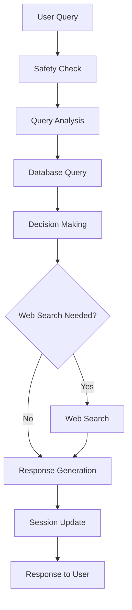

# Technical Documentation: AI Mobile Phone Shopping Agent

## Table of Contents
1. [Architecture Overview](#architecture-overview)
2. [Core Components](#core-components)
3. [AI Logic Flow](#ai-logic-flow)
4. [Dynamic Query Understanding](#dynamic-query-understanding)
5. [Database Design](#database-design)
6. [LLM Integration](#llm-integration)
7. [Web Search Integration](#web-search-integration)
8. [Session Management](#session-management)
9. [API Endpoints](#api-endpoints)
10. [Performance Optimizations](#performance-optimizations)

## Architecture Overview

Our AI Mobile Phone Shopping Agent is built with a modular, scalable architecture that combines:

- **Dynamic LLM-based query understanding** (no hardcoded patterns)
- **Database-driven brand/model mapping**
- **Intelligent web search integration**
- **Context-aware conversation management**
- **Clean separation of concerns**

### High-Level Architecture

```
┌─────────────────┐    ┌─────────────────┐    ┌─────────────────┐
│   Frontend      │    │   FastAPI       │    │   PostgreSQL    │
│   (React.js)    │◄──►│   Backend       │◄──►│   Database      │
└─────────────────┘    └─────────────────┘    └─────────────────┘
                              │
                              ▼
                       ┌─────────────────┐
                       │   AI Modules    │
                       │   (LLM Service) │
                       └─────────────────┘
                              │
                              ▼
                    ┌─────────────────────┐
                    │   LLM Providers     │
                    │ ┌─────────────────┐ │
                    │ │   Gemini 2.0    │ │
                    │ │   (Primary)     │ │
                    │ └─────────────────┘ │
                    │ ┌─────────────────┐ │
                    │ │   OpenAI GPT    │ │
                    │ │   (Fallback)    │ │
                    │ └─────────────────┘ │
                    └─────────────────────┘
                              │
                              ▼
                       ┌─────────────────┐
                       │   Web Search    │
                       │   (Google CSE)  │
                       └─────────────────┘
```

## Core Components

### 1. AI Module (`ai/`)

#### `agent.py` - Main AI Agent
- **Purpose**: Orchestrates the entire query processing pipeline
- **Key Methods**:
  - `process_query()`: Main entry point for processing user queries
  - `_get_phones_from_analysis()`: Converts query analysis to database filters
  - `_get_web_search_data()`: Handles web search with query enhancement

#### `ai_logic.py` - AI Logic Components
- **DynamicQueryAnalyzer**: Analyzes user queries using LLM + database
- **SmartDecisionMaker**: Decides when to use web search vs database
- **SafetyHandler**: Ensures queries are safe and relevant
- **AIResponseGenerator**: Generates context-aware responses

#### `templates.py` - LLM Prompt Templates
- **Centralized prompt management** for all LLM operations
- **Consistent prompt formatting** across the system
- **Easy maintenance and updates** of AI behavior

#### `llm_service.py` - Multi-Provider LLM Service
- **Provider Management**: Handles Gemini and OpenAI API integration
- **Automatic Fallback**: Switches providers on quota/rate limit errors
- **Error Detection**: Identifies quota exceeded, rate limits, and API failures
- **Async Support**: Full async/await implementation for better performance
- **Cost Optimization**: Uses free Gemini when available, falls back to paid OpenAI

### 2. Utils Module (`utils/`)

#### `query_processor.py` - Query Processing Utilities
- **QueryProcessor**: Main query processing class
- **PriceExtractor**: Extracts price ranges from natural language
- **FeatureExtractor**: Identifies feature requirements
- **DatabaseQueryBuilder**: Builds dynamic database queries
- **ResponseFormatter**: Formats data for AI consumption

#### `web_search.py` - Web Search Service
- **Google Custom Search Engine integration**
- **Phone information and comparison search**
- **Error handling and fallback mechanisms**

#### `user_sessions.py` - Session Management
- **UserSession**: Manages individual user sessions
- **ConversationMessage**: Stores conversation history
- **UserPreferences**: Tracks user preferences over time
- **SessionManager**: Handles session lifecycle

### 3. Database Models

#### `database.py` - SQLAlchemy Models
- **MobilePhone**: Core phone data model
- **Brand**: Brand information with aliases
- **PhoneModel**: Model information with search terms
- **SearchPattern**: Dynamic pattern learning

#### `models.py` - Pydantic Models
- **API request/response models**
- **Data validation and serialization**
- **Type safety and documentation**

## AI Logic Flow

### 1. Query Processing Pipeline



### 2. Dynamic Query Understanding

#### Step 1: Query Analysis
```python
# Example: "show me Redmi 12C"
query_analysis = {
    "brands": ["Xiaomi"],           # Redmi maps to Xiaomi
    "models": ["Redmi 12C"],        # Specific model identified
    "price_range": {"min": None, "max": None},
    "features": [],
    "confidence": 0.95
}
```

#### Step 2: Database Query Building
```python
# Dynamic filter building
filters = {
    "brands": ["Xiaomi"],
    "models": ["Redmi 12C"]
}
# Results in: WHERE brand ILIKE '%Xiaomi%' AND name ILIKE '%Redmi 12C%'
```

#### Step 3: Smart Decision Making
```python
# LLM decides: "DATABASE_ONLY" or "WEB_SEARCH"
decision = smart_decision_maker.should_use_web_search(
    query="show me Redmi 12C",
    db_results_count=1,
    db_phones=[redmi_12c],
    conversation_history=[]
)
```

### 3. LLM-Based Decision Making

#### Web Search Decision Logic
The system uses an LLM to intelligently decide when to use web search:

**Use WEB_SEARCH when:**
- User asks for "best phones" (plural) but database has limited results
- User asks for latest/newest phones not in database
- User asks for comparisons with phones not in database
- User asks for current prices, release dates, or recent reviews

**Use DATABASE_ONLY when:**
- User asks about specific phones well-covered in database
- User asks for detailed specifications of known phones
- Database results are comprehensive for the query

#### Query Enhancement
When web search results are poor, the system enhances the query:

```python
# Original: "phones under 10k"
# Enhanced: "best budget smartphones under ₹10,000 2024 latest models reviews"
```

## Database Design

### Core Tables

#### 1. `mobile_phones`
```sql
CREATE TABLE mobile_phones (
    id SERIAL PRIMARY KEY,
    name VARCHAR NOT NULL,
    brand VARCHAR NOT NULL,
    price FLOAT NOT NULL,
    display_size FLOAT,
    display_resolution VARCHAR,
    processor VARCHAR,
    ram INTEGER,
    storage INTEGER,
    camera_main VARCHAR,
    camera_front VARCHAR,
    battery_capacity INTEGER,
    charging_speed VARCHAR,
    os VARCHAR,
    weight FLOAT,
    dimensions VARCHAR,
    colors TEXT,
    features TEXT,
    image_url VARCHAR,
    description TEXT,
    ois BOOLEAN DEFAULT FALSE,
    eis BOOLEAN DEFAULT FALSE,
    wireless_charging BOOLEAN DEFAULT FALSE,
    water_resistance VARCHAR,
    fingerprint_sensor BOOLEAN DEFAULT FALSE,
    face_unlock BOOLEAN DEFAULT FALSE
);
```

#### 2. `brands`
```sql
CREATE TABLE brands (
    id SERIAL PRIMARY KEY,
    name VARCHAR(100) UNIQUE NOT NULL,
    display_name VARCHAR(100) NOT NULL,
    aliases TEXT,  -- JSON: ["Redmi", "Mi", "POCO"]
    parent_brand VARCHAR(100),
    is_active BOOLEAN DEFAULT TRUE
);
```

#### 3. `phone_models`
```sql
CREATE TABLE phone_models (
    id SERIAL PRIMARY KEY,
    name VARCHAR(200) NOT NULL,
    brand_id INTEGER REFERENCES brands(id),
    search_terms TEXT,  -- JSON: ["12C", "Redmi 12"]
    model_variants TEXT,  -- JSON: ["12C", "12", "12 Pro"]
    is_active BOOLEAN DEFAULT TRUE
);
```

### Brand Mapping Examples

| User Input | Mapped Brand | Aliases |
|------------|--------------|---------|
| "Redmi" | Xiaomi | ["Redmi", "Mi", "POCO"] |
| "Galaxy" | Samsung | ["Galaxy", "Note"] |
| "Pixel" | Google | ["Pixel", "Google Pixel"] |
| "Moto" | Motorola | ["Moto", "Motorola", "Edge"] |

## LLM Integration

### Multi-Provider LLM Service with Automatic Fallback
- **Primary Provider**: Gemini 2.0 Flash (`gemini-2.0-flash`)
- **Fallback Provider**: OpenAI GPT-3.5 Turbo (`gpt-3.5-turbo`)
- **Integration**: Custom LLM service with automatic provider switching
- **Use Cases**:
  - Query analysis and understanding
  - Intent extraction
  - Web search decision making
  - Response generation
  - Safety checking

### LLM Service Architecture (`ai/llm_service.py`)
- **Automatic Fallback**: Detects quota/rate limit errors and switches providers
- **Error Detection**: Identifies 429 errors, quota exceeded, rate limits
- **Provider Switching**: Seamless transition between Gemini and OpenAI
- **Retry Logic**: Built-in retry mechanism with exponential backoff
- **Async Support**: Full async/await implementation for better performance

### Prompt Engineering

#### 1. Query Analysis Prompt
```python
prompt = f"""
You are an expert at understanding mobile phone queries. Extract brand and model information from the user's query.

User Query: "{query}"
Available Brands: {', '.join(available_brands)}
Available Models: {', '.join(available_models)}

Extract and return ONLY a JSON object with this structure:
{{
    "brands": ["brand1", "brand2"],
    "models": ["model1", "model2"],
    "price_range": {{"min": null, "max": null}},
    "features": ["feature1", "feature2"],
    "confidence": 0.95
}}
"""
```

#### 2. Decision Making Prompt
```python
prompt = f"""
You are an intelligent decision maker for a mobile phone shopping assistant. Determine whether to use web search.

User Query: "{query}"
Database Results Count: {db_results_count}
Database Phones: {db_phones}

Respond with ONLY: "WEB_SEARCH" or "DATABASE_ONLY"
"""
```

### Error Handling & Fallback System
- **JSON Parsing**: Robust fallback for malformed LLM responses
- **Rate Limiting**: Built-in retry mechanisms with provider switching
- **Quota Management**: Automatic detection of quota exceeded errors
- **Provider Fallback**: Seamless switching from Gemini to OpenAI when needed
- **Graceful Degradation**: Rule-based fallbacks when all LLM providers fail

### Fallback Logic Flow
```python
# 1. Try primary provider (Gemini)
try:
    response = await gemini_model.generate_content(prompt)
    return response
except QuotaExceededError:
    # 2. Switch to fallback provider (OpenAI)
    response = await openai_client.chat.completions.create(...)
    return response
except Exception:
    # 3. Use rule-based fallback
    return fallback_response
```

### Provider Configuration
- **Environment Variables**: 
  - `GEMINI_API_KEY`: Primary provider API key
  - `OPENAI_API_KEY`: Fallback provider API key
- **Model Selection**:
  - Gemini: `gemini-2.0-flash` (faster, more cost-effective)
  - OpenAI: `gpt-3.5-turbo` (reliable fallback)
- **Cost Optimization**: Uses free Gemini when available, falls back to paid OpenAI

### LLM Service Implementation Details
```python
class LLMService:
    def __init__(self):
        self.primary_provider = "gemini"
        self.fallback_provider = "openai"
        
    async def generate_content(self, prompt: str, max_retries: int = 2) -> str:
        for attempt in range(max_retries):
            try:
                if self.primary_provider == "gemini":
                    return await self._generate_with_gemini(prompt)
                elif self.primary_provider == "openai":
                    return await self._generate_with_openai(prompt)
            except Exception as e:
                if self.is_quota_exceeded(str(e)):
                    # Switch providers on quota error
                    self.primary_provider, self.fallback_provider = \
                        self.fallback_provider, self.primary_provider
                    continue
                else:
                    raise e
```

### Benefits of Multi-Provider Architecture
- **High Availability**: System continues working even when one API fails
- **Cost Efficiency**: Maximizes free tier usage before switching to paid
- **Performance**: Async implementation reduces latency
- **Reliability**: Multiple fallback layers ensure system stability
- **Scalability**: Easy to add more providers in the future

## Web Search Integration

### Google Custom Search Engine
- **API**: Google Custom Search API v1
- **Search Types**:
  - General phone information
  - Phone comparisons
  - Latest reviews and prices

### Search Strategy
1. **Primary Search**: Use original user query
2. **Enhanced Search**: If results are poor, enhance query using LLM
3. **Fallback**: Return database results if web search fails

### Example Search Flow
```python
# Original query: "best phones under 10k"
web_results = web_search.search_phone_info("best phones under 10k")

# If results are poor, enhance:
enhanced_query = "best budget smartphones under ₹10,000 2024 latest models reviews"
enhanced_results = web_search.search_phone_info(enhanced_query)
```

## Session Management

### User Authentication & Sessions
- **JWT Authentication**: Secure token-based authentication with 30-minute expiry
- **User Registration**: Email/password registration with bcrypt hashing
- **Session Management**: Dual storage system (LangChain + Database)
- **Guest Mode**: Non-authenticated users can still use the system

### Conversation History System
- **Dual Storage Architecture**:
  - **LangChain Memory**: In-memory `ConversationBufferWindowMemory` with `k=10` (last 10 exchanges)
  - **Database Storage**: Persistent PostgreSQL storage for all conversations
- **History Retrieval**: 
  - **Authenticated Users**: Full conversation history from LangChain memory
  - **Guest Users**: No conversation history (empty context)
- **Context Preparation**:
  - **Last 3 Messages**: Only most recent 3 exchanges included in AI prompt
  - **Truncated Responses**: AI responses truncated to 150 characters for token efficiency
  - **Format**: `User: [message]` → `AI: [response...]` pattern
- **Memory Management**:
  - **Session Manager**: Keeps last 10 conversations in memory
  - **LangChain Memory**: Keeps last 10 exchanges (k=10)
  - **Database**: Stores all conversations permanently

### User Session Structure
```python
class UserSession:
    session_id: str
    created_at: datetime
    last_active: datetime
    conversation_history: List[ConversationMessage]
    user_preferences: Dict[str, Any]  # Flexible dict for preferences
```

### Conversation Context Logic
```python
def _prepare_conversation_context(self, conversation_history: List) -> str:
    """Prepare conversation context - only last 3 exchanges"""
    if not conversation_history:
        return ""
    
    context = "Recent conversation context:\n"
    for msg in conversation_history[-3:]:  # Only last 3 messages
        if hasattr(msg, 'content'):
            if 'Human' in msg.__class__.__name__:
                context += f"User: {msg.content}\n"
            elif 'AI' in msg.__class__.__name__:
                context += f"AI: {msg.content[:150]}...\n\n"  # Truncated
```

### Preference Learning
- **Dynamic Extraction**: User preferences extracted from conversation history
- **Budget Tracking**: Automatic budget range detection
- **Brand Preferences**: Learned from user choices
- **Feature Focus**: Camera, gaming, battery preferences identified

## Query Type Detection & Response Strategy

### Intelligent Query Classification
The AI now intelligently detects query types and adjusts response strategy accordingly:

#### 1. Specific Phone Queries
- **Detection**: "tell me about X", "what's the camera of Y", "charging speed of Z"
- **Response Strategy**: Focus ONLY on that specific phone
- **No Alternatives**: Do not suggest alternative recommendations
- **Example**: "tell me about Realme Narzo 70 Pro 5G camera quality" → Detailed info about that phone only

#### 2. General Recommendation Queries  
- **Detection**: "best phones under X", "show me gaming phones", "recommend phones"
- **Response Strategy**: Provide multiple options and comparisons
- **Multiple Options**: Show various relevant phones from database
- **Example**: "best camera phones under ₹30,000" → Multiple phone recommendations

#### 3. Comparison Queries
- **Detection**: "compare X vs Y", "iPhone 15 vs Samsung S24"
- **Response Strategy**: Focus on the comparison, minimal alternatives
- **Direct Comparison**: Detailed comparison of specified phones
- **Example**: "compare iPhone 15 vs Samsung S24" → Focused comparison

### Prompt Engineering for Query Types
```python
QUERY TYPE DETECTION:
- **SPECIFIC PHONE QUERY**: If user asks about a specific phone
  → Focus ONLY on that specific phone, provide detailed information, DO NOT suggest alternatives
- **GENERAL RECOMMENDATION QUERY**: If user asks for recommendations
  → Provide multiple options and comparisons
- **COMPARISON QUERY**: If user compares specific phones
  → Focus on the comparison, minimal alternatives

SPECIFIC PHONE QUERY RULES:
- **DO NOT provide alternative recommendations unless explicitly asked**
- **Focus entirely on the specific phone they're asking about**
- **Provide detailed, comprehensive information about that phone only**
- **Only suggest alternatives if user explicitly asks "what are other options"**
```

## Recent Updates & Bug Fixes

### OpenAI Fallback System (Latest - December 2024)
- **Issue**: Gemini API quota exceeded (200 requests/day limit) causing system failures
- **Solution**: Implemented multi-provider LLM service with automatic fallback
- **Implementation**:
  - **LLM Service**: New `ai/llm_service.py` with provider switching logic
  - **Automatic Detection**: Detects quota/rate limit errors (429, "quota", "rate limit")
  - **Seamless Switching**: Automatically switches from Gemini to OpenAI
  - **All Components Updated**: SafetyHandler, DynamicQueryAnalyzer, SmartDecisionMaker, AIResponseGenerator
  - **Async Implementation**: Full async/await support for better performance
- **Result**: System now bulletproof against API quota issues, continues working seamlessly

### Authentication System
- **User Registration**: Email/password registration with proper error handling
- **JWT Tokens**: 30-minute expiry with automatic refresh
- **Login Flow**: Improved UI with success messages and automatic mode switching
- **Guest Mode**: Non-authenticated users can still use the chat system

### ChatResponse Model Fix
- **Issue**: `ChatResponse` object missing `conversation_id` field causing 500 errors
- **Solution**: Added `conversation_id: Optional[int] = None` to ChatResponse model
- **Result**: Chat endpoint now works for both authenticated and guest users

### Query Type Detection Enhancement
- **Issue**: AI providing unwanted alternative recommendations for specific phone queries
- **Solution**: Added intelligent query type detection in prompt templates
- **Implementation**: 
  - Specific phone queries → Focus only on that phone
  - General queries → Provide multiple options
  - Comparison queries → Focus on comparison
- **Result**: Context-aware responses based on query intent

### Frontend Improvements
- **Registration Success Flow**: Shows success message and auto-switches to login mode
- **Email Pre-fill**: Keeps email when switching from registration to login
- **Error Handling**: Better error messages with actionable suggestions
- **Markdown Rendering**: AI responses now render with proper markdown formatting

### Database Schema Updates
- **User Tables**: Added `users`, `conversations`, `conversation_messages` tables
- **Conversation Tracking**: Full conversation history stored in database
- **Phone Data**: Enhanced with more diverse phone models for better coverage

## API Endpoints

### 1. Chat Endpoint
```http
POST /chat
Content-Type: application/json

{
    "message": "show me Redmi 12C",
    "session_id": "optional-session-id"
}
```

**Response:**
```json
{
    "response": "Here's the Redmi 12C...",
    "recommendations": [
        {
            "id": 1,
            "name": "Redmi 12C",
            "brand": "Xiaomi",
            "price": 8999.0,
            "display_size": 6.71,
            "processor": "MediaTek Helio G85",
            "ram": 4,
            "storage": 64,
            "camera_main": "50MP + 2MP",
            "battery_capacity": 5000
        }
    ],
    "session_id": "generated-session-id",
    "used_web_search": false,
    "user_intent": {
        "intent": "recommendation",
        "budget_range": {"min": null, "max": null},
        "preferred_brands": ["Xiaomi"],
        "feature_focus": []
    },
    "timestamp": "2024-01-15T10:30:00Z"
}
```

### 2. Authentication Endpoints

#### User Registration
```http
POST /auth/register
Content-Type: application/json

{
    "email": "user@example.com",
    "password": "password123",
    "full_name": "John Doe"
}
```

#### User Login
```http
POST /auth/login
Content-Type: application/json

{
    "email": "user@example.com",
    "password": "password123"
}
```

**Response:**
```json
{
    "access_token": "eyJhbGciOiJIUzI1NiIsInR5cCI6IkpXVCJ9...",
    "token_type": "bearer"
}
```

#### Get Current User
```http
GET /auth/me
Authorization: Bearer <token>
```

### 3. Conversation Endpoints

#### Get User Conversations
```http
GET /conversations
Authorization: Bearer <token>
```

#### Get Conversation Messages
```http
GET /conversations/{conversation_id}/messages
Authorization: Bearer <token>
```

### 4. Phones Endpoint
```http
GET /phones?brand=Xiaomi&max_price=10000
```

### 5. Compare Endpoint
```http
POST /compare
Content-Type: application/json

{
    "phone_ids": [1, 2, 3]
}
```

## Performance Optimizations

### 1. Database Optimizations
- **Indexed columns**: `name`, `brand`, `price`
- **Query limits**: Maximum 20 results per query
- **Connection pooling**: Efficient database connections

### 2. LLM Optimizations
- **Prompt caching**: Reuse similar prompts
- **Response streaming**: For long responses
- **Error handling**: Graceful degradation

### 3. Web Search Optimizations
- **Result caching**: Cache search results
- **Query enhancement**: Only when needed
- **Rate limiting**: Respect API limits

### 4. Session Optimizations
- **Memory-based sessions**: Fast access
- **Automatic cleanup**: Remove old sessions
- **Preference caching**: Quick preference lookup

## System Resilience & Reliability

### 1. Multi-Provider LLM Architecture
- **Automatic Failover**: Seamless switching between Gemini and OpenAI
- **Quota Management**: Intelligent detection and handling of API limits
- **Cost Optimization**: Maximizes free tier usage before switching to paid
- **Zero Downtime**: System continues working even when one provider fails

### 2. Error Handling & Recovery
- **Graceful Degradation**: System provides useful responses even with partial failures
- **Retry Logic**: Built-in retry mechanisms with exponential backoff
- **Fallback Responses**: Rule-based responses when all AI providers fail
- **User Experience**: Users see no difference during provider switches

### 3. Performance & Scalability
- **Async Implementation**: Non-blocking operations for better performance
- **Connection Pooling**: Efficient database and API connections
- **Caching Strategy**: Intelligent caching of responses and data
- **Load Balancing**: Ready for horizontal scaling

## Security Considerations

### 1. Input Validation
- **Pydantic models**: Automatic validation
- **SQL injection prevention**: Parameterized queries
- **XSS protection**: Input sanitization

### 2. API Security
- **Rate limiting**: Prevent abuse
- **CORS configuration**: Secure cross-origin requests
- **Error handling**: No sensitive data in errors

### 3. Data Privacy
- **Session isolation**: User data separation
- **No persistent storage**: Sessions in memory only
- **Secure API keys**: Environment variable management

## Monitoring and Logging

### 1. Application Logs
- **Query processing**: Track user queries
- **LLM calls**: Monitor AI performance
- **Database queries**: Track query performance
- **Web search**: Monitor search success rates

### 2. Performance Metrics
- **Response time**: Track API response times
- **LLM latency**: Monitor AI response times
- **Database performance**: Query execution times
- **Error rates**: Track system reliability

### 3. Business Metrics
- **User engagement**: Session duration and frequency
- **Query success**: Successful recommendations
- **Feature usage**: Most used features
- **User satisfaction**: Response quality metrics

## Future Enhancements

### 1. Advanced AI Features
- **Multi-modal support**: Image and voice queries
- **Personalized recommendations**: ML-based suggestions
- **Conversation memory**: Long-term user preferences
- **Multi-language support**: International markets

### 2. Database Enhancements
- **Real-time updates**: Live price and availability
- **User reviews**: Community feedback integration
- **Price tracking**: Historical price data
- **Inventory management**: Stock levels

### 3. Performance Improvements
- **Caching layer**: Redis for faster responses
- **CDN integration**: Faster static content
- **Database sharding**: Scale to millions of phones
- **Microservices**: Break into smaller services

### 4. Integration Opportunities
- **E-commerce APIs**: Direct purchase integration
- **Review platforms**: Aggregate review data
- **Price comparison**: Multi-vendor price comparison
- **Social features**: User reviews and ratings

---

This technical documentation provides a comprehensive overview of our AI Mobile Phone Shopping Agent's architecture, implementation, and capabilities. For more specific implementation details, refer to the source code in the respective modules.
